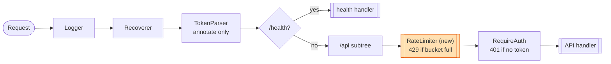

# Go CRM API Server — Architecture

Module `github.com/weave-lab/interview-public/go` · **Go 1.26.3** (`go/go.mod:3`)
Router: `go-chi/chi/v5` · DB: `modernc.org/sqlite` (pure-Go, cgo-free).

## Startup flow

- `go/cmd/server/main.go` — parses flags (`-addr` `:8080`, `-data` `data`, `-seed`,
  `-contacts` 10000, `-files` 20), opens the SQLite store, optionally seeds, then builds
  the router with `app.NewRouter(s, app.Options{EnableLogging: true})` and serves it via
  `http.Server` with graceful SIGINT/SIGTERM shutdown (5s timeout).
- `go/internal/app/app.go` — `NewRouter(s, opts) http.Handler` assembles the chi router
  and the full middleware chain. **This is the file we touch for the limiter.**

## Request pipeline (the key part)



The limiter is added **inside the `/api` subtree** (so `/health` stays exempt).

`go/internal/app/app.go:18-54`:

```go
r := chi.NewRouter()
if opts.EnableLogging { r.Use(middleware.Logger) }   // :23
r.Use(middleware.Recoverer)                           // :25
r.Use(auth.TokenParser)                               // :26  global, annotates only
r.Get("/health", ...)                                 // :28  public, no auth
r.Route("/api", func(r chi.Router) {
    r.Use(auth.RequireAuth)                           // :33  rejects 401 if no token
    // contacts CRUD, import/export, files, reports...
})
```

**Middleware signature** is the standard `net/http` decorator:
`func(next http.Handler) http.Handler`. chi's `r.Use(...)` takes exactly this, and applies
them in registration order. All `r.Use(...)` calls must precede route registration on that
router.

### Where the limiter plugs in

Our limiter middleware will have the same `func(http.Handler) http.Handler` shape and drop
straight into a `r.Use(...)` line.

**Decision (see `rate-limiter-plan.md` §5):** API-only (so `/health` is exempt), and placed
**before** `auth.RequireAuth` so the limiter is the front door of `/api` and unauthenticated
requests count — matching the Java placement. Add `r.Use(rl.Middleware)` as the **first**
`r.Use(...)` inside the `r.Route("/api", ...)` closure, ahead of `auth.RequireAuth` (`app.go:33`).

Since the assignment wants a **single global bucket**, the middleware closes over **one**
shared limiter instance created once in `NewRouter` (not per-request). The entire
leak→check→increment runs inside one `sync.Mutex` critical section (no lock-free fast path).

## Auth

`go/internal/auth/auth.go`: `TokenParser` (global) reads the `Authorization: Bearer <email>`
header, validates it against an email regex, and stores it in request context — it never
rejects. `RequireAuth` (scoped to `/api`) returns 401 if no valid token. The "token" *is*
an email; any syntactically valid email is accepted as the user id. Tests use
`Bearer test@example.com`.

## Handlers & store (brief)

- **Handlers** (`internal/api/*`): contacts (keyset/cursor pagination, CRUD, bulk import
  ≤10k, CSV export), files (multipart upload ≤100MB, blob on disk + metadata row, download
  streams), reports (activity aggregation). All use `writeJSON`/`writeError` helpers in
  `internal/api/api.go`.
- **Store** (`internal/store/*`): single shared `*sql.DB` (safe for concurrent use), SQLite
  at `data/app.db` with embedded `schema.sql`; file blobs on disk under `data/files/`.

## Testing setup (model our tests on this)

`go/api_test.go`, package `main_test`:

- **`TestMain`** builds the harness once: temp dir → `store.New` → small seed
  (`Contacts:1000, Files:5`, `seed.SetQuiet(true)`) → `app.NewRouter(..., EnableLogging:false)`
  → `httptest.NewServer(r)`, stored in package globals `testServer` / `testStore`.
- **Helper `authedRequest(method, path, body) *http.Request`** builds a request against
  `testServer.URL+path` with `Authorization: Bearer test@example.com`. **Reuse this** in the
  limiter test.
- The file currently holds **only benchmarks** (serial + `b.RunParallel`), no `Test*`
  functions. Our first addition is `func TestRateLimit(t *testing.T)` asserting `429` once
  the global limit trips.
- ⚠️ **Test isolation caveat:** all tests share one `testServer`/limiter instance, so global
  limiter state persists across the whole test binary. Prefer unit-testing the limiter core
  directly with an **injected clock** (deterministic, no `sleep`), and keep the HTTP-level
  test minimal / self-contained.

## Concurrency note

There is currently **no shared mutable in-memory state** in the server — safety rests on
`database/sql`'s pool and per-request goroutines. Our limiter would be the **first** piece of
shared mutable state, so it must bring its own concurrency safety (`sync.Mutex` guarding the
bucket level is the clean, obvious choice). `golang.org/x/time/rate` is **not** currently a
dependency — we'll implement the leaky bucket ourselves (it's the point of the exercise).
