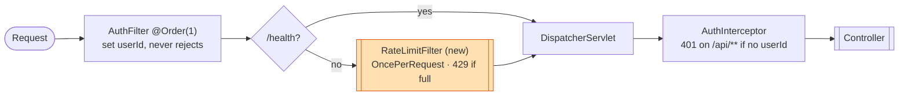

# Java Spring Boot CRM API Server — Architecture

Base package `com.weavelab.interview` · **Java 17** · **Spring Boot 3.3.0** (`jakarta.*`
namespace) · `spring-boot-starter-web` + `spring-boot-starter-jdbc` · SQLite via
`org.xerial:sqlite-jdbc` (JdbcTemplate, no ORM).

## Startup flow

- `Application.java` — plain `@SpringBootApplication`; component scan covers the whole tree.
- `config/DataSourceConfig.java` — creates `data/` + `data/files/`, runs `schema.sql`
  (classpath) via `ResourceDatabasePopulator`, exposes a single `JdbcTemplate` bean.
- `config/AppConfig.java` — holds `app.data-dir` / `app.max-upload-size` properties.
- `config/WebConfig.java` — `WebMvcConfigurer` that registers `AuthInterceptor` globally in
  `addInterceptors` (**the only place an interceptor is registered** — relevant if we choose
  the interceptor route for the limiter).
- `seed/StartupCheck.java` — `CommandLineRunner`; if DB empty, prints seed instructions and
  `System.exit(1)`. Disabled in tests via `app.startup-check=false`.

## Request pipeline — two global layers (the key part)



Servlet **filters** run before `DispatcherServlet`; the **interceptor** runs inside it. The new
limiter is a `OncePerRequestFilter` after `AuthFilter`, skipping non-`/api/` paths so `/health`
stays exempt.

Every request passes through, in order:

**Layer 1 — Servlet Filter `auth/AuthFilter.java`** — `@Component @Order(1) implements Filter`.
Auto-registered for **all URLs** simply by being a `Filter` component (runs before
`DispatcherServlet`). Reads `Authorization: Bearer <email>`, validates the email regex, and
sets the `userId` request attribute (`AuthFilter.USER_ID_ATTRIBUTE`). **Never rejects** — only
annotates.

**Layer 2 — MVC `HandlerInterceptor` `auth/AuthInterceptor.java`** — active only because
`WebConfig.addInterceptors` registers it. Runs inside `DispatcherServlet`, after the filter,
before the controller. For `/api/**`, returns `401` if the `userId` attribute is missing;
`/health` and other non-`/api/` paths pass through.

> **Filter vs Interceptor:** the Filter is servlet-container level (all requests, no knowledge
> of the matched controller); the Interceptor is Spring-MVC level (only dispatched handlers,
> supports path patterns, has the handler object). Here Filter = *authenticate*, Interceptor =
> *authorize*.

### Where the limiter plugs in

The assignment wants a **single global bucket**, so whichever we pick holds **one** shared
limiter instance (a singleton `@Component`).

**Decision (see `rate-limiter-plan.md` §5):** a filter that extends **`OncePerRequestFilter`**
(not raw `Filter`) so async re-dispatch can't double-count one request, registered via a
**`FilterRegistrationBean`** with explicit order and dispatch `REQUEST` only. It **skips any
path not under `/api/`** so `/health` is exempt, and runs before `AuthInterceptor` so
unauthenticated `/api` requests count (matches Go). It does **not** read `userId` — the limit is
global. Short-circuits with `429` + `Retry-After` before MVC.

- *Why not a raw `@Order(2) Filter`:* a plain `Filter` also fires on `ASYNC`/`ERROR` dispatch,
  so a `Callable`/`DeferredResult` endpoint would consume two tokens; `OncePerRequestFilter`
  guarantees one execution per client request.
- *Why not a `HandlerInterceptor`:* it runs inside `DispatcherServlet` (after more of the
  stack); a filter short-circuits earlier. Either works, but the filter is the cleaner front
  door. (An interceptor with `.addPathPatterns("/api/**")` is the fallback.)

Thread-safety: one `ReentrantLock`/`synchronized` section covers **all** access to the bucket's
`level`/`last` (so no `volatile` needed); no I/O inside the lock.

## Auth

Bearer "token" is literally an email — no signing/lookup/expiry. `AuthFilter` validates and
stores it as `userId`; `AuthInterceptor` enforces its presence on `/api/**` (401 otherwise).
`POST /api/auth/token` echoes `{user_id, status:"authenticated"}`.

## Controllers & persistence (brief)

- `HealthController` `GET /health` → `"ok"` (unauthenticated).
- `AuthController` `/api/auth/token`. `ContactController` `/api/contacts` (keyset-paginated
  list, CRUD, `/import` ≤10k, `/export` CSV via OpenCSV). `FileController` `/api/files`
  (multipart upload → `data/files/<uuid>` + metadata row, download streams). `ReportController`
  `/api/reports/activity` (aggregates `activity_log`).
- Repositories use `JdbcTemplate`; keyset pagination `WHERE (created_at, id) < (?, ?)`; file
  bytes on disk, metadata in SQLite. Models are POJOs with Jackson snake_case mapping.

## Testing setup (model our tests on this)

`src/test/java/.../ApplicationTests.java` is currently just `contextLoads()`:

```java
@SpringBootTest
@TestPropertySource(properties = {
    "app.data-dir=target/test-data",
    "spring.datasource.url=jdbc:sqlite:target/test-data/app.db",
    "app.startup-check=false"   // <-- MUST keep: prevents StartupCheck System.exit(1)
})
```

- `@SpringBootTest` loads the full context but starts **no** web layer by default. No MockMvc /
  HTTP helpers exist yet.
- To test the limiter, add web testing — **recommended: `@AutoConfigureMockMvc`** (wires the
  servlet filters including `AuthFilter` into the MockMvc chain, so both auth layers run):

  ```java
  mockMvc.perform(get("/api/contacts").header("Authorization", "Bearer user@example.com"))
         .andExpect(status().isOk());
  // ...after limit exceeded:
         .andExpect(status().isTooManyRequests()); // 429
  ```

  Alternative: `@SpringBootTest(webEnvironment = RANDOM_PORT)` + `TestRestTemplate`.
- Keep the `@TestPropertySource` block (isolated SQLite DB + `app.startup-check=false`). DB is
  empty in tests → hammer an endpoint that needs no seeded rows (`POST /api/auth/token` or
  `GET /api/contacts` returning empty list). Provide a valid `Bearer <email>` so requests pass
  auth and actually reach the limiter.
- Prefer unit-testing the limiter core directly with an **injected clock** (deterministic, no
  `Thread.sleep`); keep the MockMvc test focused on "429 after the limit."

## Concurrency note

No existing rate-limiting/caching lib (no Bucket4j/Resilience4j/Guava/Caffeine). We hand-roll
the leaky bucket (the point of the exercise) as a thread-safe singleton — a `synchronized`
block or `ReentrantLock` guarding the bucket level is the clean choice, since the filter is hit
by many Tomcat worker threads concurrently.
