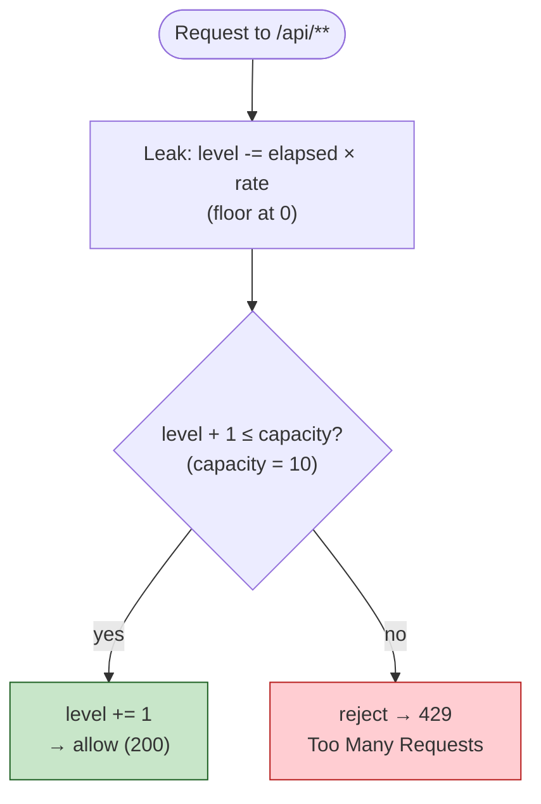

# Rate Limiter — Design & Build Plan

## 1. Assignment

A **process-local** (in-memory, no distributed state), **global** rate limiter — one shared
bucket for *all* clients — allowing **10 requests / minute**. Clean, tested, documented.
Implement in **both Go and Java** with identical behavior. (TypeScript appears only as a
mental-model aid; it is not a deliverable.)

## 2. Confirmed decisions

| Decision | Choice |
|----------|--------|
| Algorithm (default) | **Leaky bucket**, counter form (reject on overflow — see §3) |
| Second algorithm (pre-built) | **Sliding-window log** for a *strict* ≤10/60s (§3.2), selectable by config |
| Scope | One global bucket; applies to **`/api/**` only** — `/health` is exempt |
| Placement | **Before auth**, as the front door of `/api`, in both stacks → unauthenticated requests count |
| On reject | **HTTP 429** + `Retry-After: <seconds>` + each stack's existing error-JSON body; log at warn/debug |
| Concurrency | One lock guards the *entire* read-modify-write (§4) |
| Time | Injected clock for deterministic tests; monotonic where possible (§4) |

Open for confirmation (defaults in force, not blockers): (a) strict vs smoothed is now a
**config flip** (sliding-window log is pre-built); (b) unauthenticated `/api` requests count —
current default **yes**; (c) exemptions beyond `/health` (e.g. CORS `OPTIONS`, large
uploads/exports whose single call locks out everyone for a minute).

## 3. The algorithms

### 3.1 Leaky bucket (default) — counter form

A "water level" that each request raises by 1 and that leaks continuously at `capacity / period`.
Reject when it would overflow. O(1), allocation-free.

- `capacity = 10`, `leakRatePerSecond = 10 / 60 ≈ 0.1667`.
- Per request (whole block is one critical section, §4):
  1. `elapsed = max(0, now - last)`; `level = max(0, level - elapsed*rate)`; `last = now`
     (update `last` on **every** call, accept or reject).
  2. `level + 1 <= capacity` → accept, `level += 1`. Else → reject. (Rejects don't consume.)
- Invariant `0 <= level <= capacity`. Off-by-one is deliberate: 10th allowed, 11th (at
  `level == capacity`) rejected.



**Exact guarantee — state this, don't oversell "10/min".** This is *smoothing*, not a strict
window: burst of 10, then ~1 slot every 6s. Worst case across a poorly-aligned 60s window is
~20 (10 burst + ~10 leaked). Only a sliding-window log gives a literal ≤10/60s:

| Model | Worst case / 60s | Note |
|-------|------------------|------|
| Fixed window | ~20 at boundary | naive "per minute" |
| **Leaky bucket (default)** | ~20 | smooth drip, O(1) |
| Token bucket | ~20 | equivalent here |
| Sliding-window log | exactly 10 | strict; O(n) memory |

### 3.2 Sliding-window log (pre-built alternative) — strict ≤10 per rolling 60s

State is a queue of accepted-request timestamps. Per request (one critical section): evict
timestamps older than `now - 60s`; if fewer than 10 remain, accept and append `now`; else reject
with `Retry-After = 60s - (now - oldest)`. Trade-off: exact, but O(n) memory (trivial at 10) and
no burst-shaping. Implements the same interface (§4) and is selected by config — so switching
strict ↔ smoothed is a config value, not a rebuild.

## 4. Architecture

### Interface (Open/Closed)

The algorithm sits behind a one-method interface; the middleware/filter and wiring depend on the
*interface*, never a concrete type. Adding an algorithm = new type + one factory case, zero edits
elsewhere. The decision carries `Retry-After` so the HTTP layer stays algorithm-agnostic.

```go
// Go — interface + struct impls
type Decision struct { Allowed bool; RetryAfter time.Duration }
type RateLimiter interface { Allow() Decision }
```
```java
// Java — interface + class impls
public record Decision(boolean allowed, Duration retryAfter) {}
public interface RateLimiter { Decision allow(); }
```

**Selection at the composition root** (the only place that knows the concrete type): Go —
`app.Options` carries the algorithm name + params; a `newRateLimiter(cfg, clock)` factory
`switch`es and `NewRouter` builds it once. Java — an `@ConfigurationProperties`
(`app.ratelimit.algorithm`) + a `@Configuration` factory produces the single `RateLimiter` bean.

### Placement & single-instance

- **Go** (`docs/architecture-go.md`): a `func(http.Handler) http.Handler` middleware added as the
  **first** `r.Use(...)` inside the `/api` subtree, *before* `RequireAuth`. Built **once** in
  `NewRouter` and captured in the closure → exactly one instance. Unexported fields; constructor
  injection (no package global).
- **Java** (`docs/architecture-java.md`): a **`OncePerRequestFilter`** (guards against async
  re-dispatch double-counting) registered via **`FilterRegistrationBean`** (dispatch `REQUEST`,
  scoped to `/api/**`), running before `AuthInterceptor`. A single Spring **singleton bean**;
  constructor-injected into the filter. Does **not** read `userId` — the limit is global.

### Concurrency

The entire read-modify-write (clock read → leak/evict → check → mutate) runs in **one** critical
section — Go `sync.Mutex` (`Lock`/`defer Unlock`), Java one `ReentrantLock`/`synchronized`
covering *all* access to the state (so no `volatile` needed). No lock-free fast path; no I/O or
logging inside the lock. The section is O(1) arithmetic, so single-lock contention is negligible.
_(TS mental model: Node's single-threaded event loop needs no lock — but only while the method
stays synchronous.)_

### TypeScript reasoning aid (how my TS experience maps to Go)

Most of my experience is in TypeScript and I've worked in Go only a little (though I really enjoy
it), so I sketched the counter in TS first to reason about the algorithm and the concurrency model
before writing the Go. It's a mental-model aid, not a deliverable — but it's exactly where the
"Go needs a mutex here" insight came from:

```ts
type Clock = () => number; // epoch millis, injected for deterministic tests

class LeakyBucket {
  private level = 0;
  private last = this.now();
  constructor(
    private readonly capacity: number,      // 10
    private readonly ratePerMs: number,     // capacity / 60_000
    private readonly now: Clock = Date.now,
  ) {}

  tryAcquire(): boolean {
    const t = this.now();
    this.level = Math.max(0, this.level - (t - this.last) * this.ratePerMs);
    this.last = t;
    if (this.level + 1 <= this.capacity) { this.level += 1; return true; }
    return false;
  }
}
```

The key thing porting to Go: in TS this whole method is safe *for free* because Node's
single-threaded event loop can't interleave a synchronous function. Go serves each request on its
own goroutine, so the same read-modify-write **must** be wrapped in a `sync.Mutex` — which is what
`leakybucket.go` does. Same algorithm, one deliberate concurrency difference.

### Clock injection

Time is injected so tests are deterministic (no real `sleep`). Go `type Clock func() time.Time`
(elapsed via `.Sub`, monotonic); Java `java.time.Clock` (`clock.instant()`), with elapsed clamped
`>= 0` since `Instant` isn't monotonic.

## 5. Build plan (red → green, one assertion per commit)

One failing-test commit → one make-it-pass commit.

0. **Interface + config shape** — define `RateLimiter`/`Decision`; config `(capacity, period)`
   deriving `rate` internally, on the existing config seam (Go `app.Options`, Java
   `@ConfigurationProperties`) so tests/benchmarks can relax the limit. Middleware programs to the
   interface from here on.
1. **Allow N / reject N+1** — 10 allowed, 11th rejected.
2. **Leak frees a slot** — fill, advance the fake clock past one interval, next call allowed
   (proves leak-then-check).
3. **Rejects don't consume** — `last` advances on reject; leak resumes on schedule.
4. **Thread-safety** (Go/Java) — N goroutines/threads never exceed capacity (smoke test for the
   single-critical-section invariant). _(TS: assert a synchronous 11-call loop = 10 true, 1 false.)_
5. **HTTP 429 contract** — a **dedicated** router/server with a fresh bucket + injected clock (not
   the shared `testServer`); assert 11th `/api` request → 429 **and** `Retry-After`; `/health`
   never 429s. Clock seam: `NewRouterWithClock` (Go) / `@TestConfiguration` overriding the `Clock`
   bean (Java).
6. **Sliding-window log** — implement + test against the *same* interface (allow 10 / reject 11th
   / oldest ages out frees a slot / `Retry-After` correct) + a factory-selection test. Proves OCP.
7. **Wire into the app** + one end-to-end test on real routes.
8. **Docs** — short README section: the exact guarantee, tuning knobs, exemptions.

## 6. Appendix — adversarial review (talking points)

Three review agents red-teamed this plan pre-code and caught **real design bugs**, now resolved
above:

1. **"10/min" overstated** → exact guarantee + comparison table (§3.1).
2. **Non-atomic read-modify-write** → one locked critical section (§4).
3. **Stacks diverged around auth** (Go limited after auth, Java before) → unified before-auth
   placement (§2).
4. **Java raw `Filter` double-counts** on async dispatch → `OncePerRequestFilter` (§4).
5. **Shared Go test harness** leaks limiter state / throttles benchmarks → dedicated
   router+clock for limiter tests, relax via config elsewhere (§5.0/§5.5).
6. **Wall-clock hazards** → monotonic where possible, clamp `elapsed >= 0`, one signature/unit
   per stack (§4).
7. **429 under-specified** → `Retry-After` + error body required; log rejections; ignore `userId`
   (§2).

### Evolution map (if the interviewer steers)

| Wants… | Change | Blast radius |
|--------|--------|--------------|
| Strict rolling-60s cap | flip config to `SlidingWindowLog` | config value |
| Fixed-window / token bucket | new impl behind the interface | one file |
| Shaper/queue (delay not reject) | `Allow()` → async `acquire()` that waits | limiter + handler await |
| Per-client instead of global | key buckets by client id | limiter internals |

Note: rate limiting ≠ concurrency limiting (capping simultaneous slow requests is a
semaphore/bulkhead, a separate tool).
